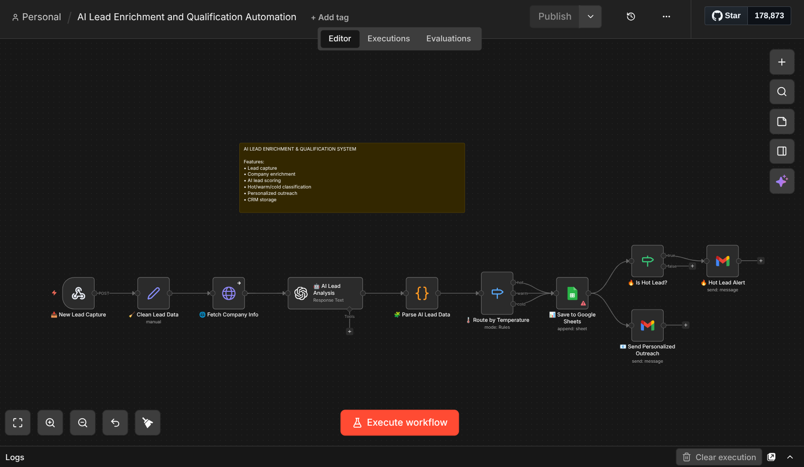

# AI Lead Enrichment & Qualification Automation (n8n)

This workflow captures incoming leads, enriches company data, analyzes lead quality with AI, classifies each lead as hot, warm, or cold, and automates follow-up actions.

---

## Workflow Overview

---

## Features

- Webhook-based lead capture
- Lead data cleaning and normalization
- Company enrichment via HTTP request
- AI lead analysis and scoring
- Hot / warm / cold lead classification
- Personalized outreach generation
- Google Sheets CRM storage
- Hot lead internal email alerts

---

## Workflow Logic

New Lead Capture → Clean Lead Data → Fetch Company Info → AI Lead Analysis → Parse AI Data → Route by Temperature → Save to Google Sheets → Send Personalized Outreach → Hot Lead Alert

---

## Input Fields

This workflow expects lead data such as:

- name
- email
- company
- website
- need

---

## AI Output

The AI analysis generates structured lead intelligence including:

- company summary
- industry
- pain points
- lead score
- lead temperature
- recommended offer
- personalized outreach message

---

## Technologies Used

- n8n
- OpenAI
- Webhook Trigger
- HTTP Request
- Google Sheets
- Gmail

---

## Use Cases

- agency lead qualification
- AI-powered sales automation
- CRM enrichment workflows
- lead scoring and prioritization
- personalized outreach automation

---

## Setup

1. Import `ai-lead-enrichment-qualification.json` into n8n
2. Connect your credentials for:
   - OpenAI
   - Google Sheets
   - Gmail
3. Add your company enrichment API key
4. Configure your Google Sheet destination
5. Test the webhook with sample lead data
6. Activate the workflow

---

## Important Notes

- Credentials are not included in this repository
- Replace placeholder values with your own API keys and email addresses
- This workflow uses AI to score and classify leads automatically

---

## Files

- `ai-lead-enrichment-qualification.json` — n8n workflow export
- `ai-lead-enrichment-qualification.png` — workflow screenshot
- `README.md` — project documentation
